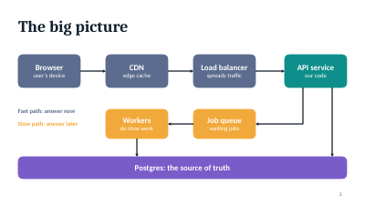
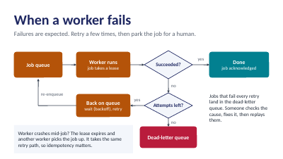
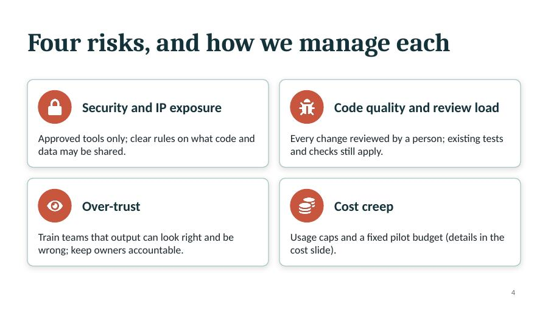
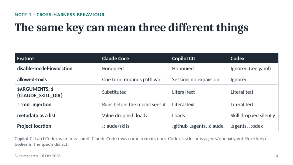
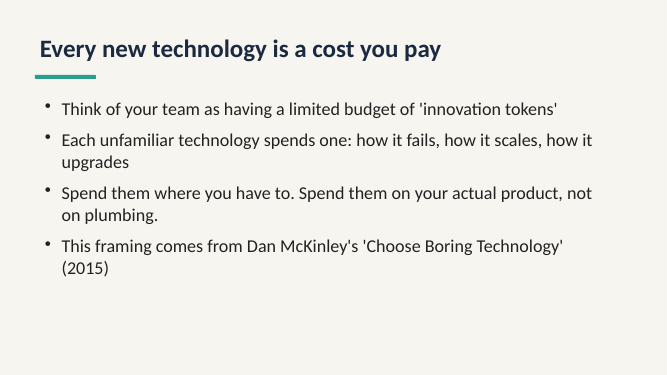
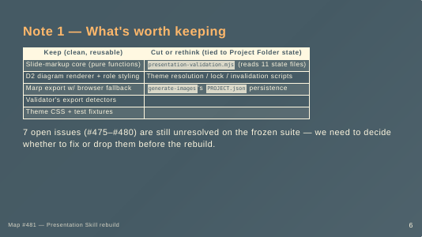

# Bare-agent deck-building baseline

Ticket: [Run a bare-agent baseline of deck building to find where skills are needed](https://github.com/ken-guru/skills/issues/482).
Map: [Rebuild the presentation skills from scratch as skill-native, loosely coupled skills](https://github.com/ken-guru/skills/issues/481).
Run date: 2026-10-08. Eval scenarios: [`bare-agent-baseline-evals.json`](bare-agent-baseline-evals.json).

## Setup

- **Agents:** Claude Code 2.1.294, headless (`claude -p --dangerously-skip-permissions`), with Sonnet and Haiku; Copilot CLI 1.0.85 on its default model (see [Copilot CLI](#copilot-cli)).
- **Bare means:** no skill from this repository installed. The Claude Code agent still had the user's claude.ai-synced `anthropic-skills:*` skills, including `anthropic-skills:pptx`. That is the real-world bare agent for this user, so it was not removed.
- **Environment:** this dev container, with Node, Python 3 (no `python` alias, no Pillow), LibreOffice, and Poppler, but no Marp, D2, or browser. pptxgenjs was already in `/tmp/node_modules` from earlier runs, so the runs were not fully independent.
- **Interaction:** one-shot `-p`, so no agent could ask clarifying questions mid-task. Scenario s4 used a second `--continue` turn for the steering feedback.

## Scenarios

| | Request |
|---|---|
| s1 | A 10-minute team update summarising three research notes in `./sources`, to present and share as PDF |
| s2 | A diagram-heavy deck on a web request's path (browser → CDN → LB → API → queue → workers → Postgres), including worker failure, for new engineers |
| s3 | A 5-minute meetup lightning talk, "Why boring technology wins", with read-aloud speaker notes |
| s4 | A 20-minute talk for non-technical managers on adopting AI coding agents: outline first and wait; then "risks before benefits, drop the history part, add a cost slide, build it" |

## Results

| Run | Skill loaded | Output | Slides / notes | Secs | Cost (USD) |
|---|---|---|---|---|---|
| Sonnet s1 | none | PPTX + PDF (built in `/tmp/build`, copied back) | 10 / 10 | 96 | 0.50 |
| Sonnet s2 | `pptx` | PPTX | 7 / 7 | 111 | 0.40 |
| Sonnet s3 | `pptx` | PPTX + PDF | 6 / 6 | 85 | 0.34 |
| Sonnet s4 | `pptx` (turn 2) | PPTX + PDF | 10 / 10 | 9 + 113 | 0.06 + 0.46 |
| Haiku s1 | read `pptx` SKILL.md by path | PPTX + PDF | 9 / 9 | 148 | 0.08 |
| Haiku s2 | `pptx` | PPTX | 10 / 10 | 192 | 0.04 |
| Haiku s3 | none | PPTX | 8 / 8 | 38 | 0.01 |
| Haiku s4 | `pptx` (turn 2) | PPTX + PDF | 10 / 10 | 13 + 91 | 0.004 + 0.02 |

All 8 runs finished with a deck. Every one chose **PPTX via pptxgenjs**. None picked Marp, HTML, Slidev, or a Markdown source.

## What the bare agent already does well

- **Content.** Tight, audience-aware structure; timing per slide; read-aloud speaker notes with transitions on every slide in every run.
- **Honesty.** Generic architecture was flagged as assumptions to verify; cost figures were left as bracketed placeholders, not invented; sources were cited (McKinley), and the s1 decks kept the research notes' "leaning, not decided" framing and their caveats.
- **Outline-first and steering (s4).** Both models stopped after the outline when asked, then applied every change. Both noticed the outline had no history section to drop and said so instead of silently deleting something else.
- **Visual self-check.** Every run rendered slides to images (LibreOffice → PDF → `pdftoppm`), looked at them, and fixed overflow or alignment before finishing.
- **Look.** With the `pptx` skill, decks were polished and consistent: themed cards, icons, tables, numbered steps. See the sample renders below.
- **Diagrams.** Built from native shapes and connectors. Readable and on-message (a fast/slow path diagram; a retry and dead-letter flowchart with decision diamonds). Connector routing was occasionally awkward (crossing lines in Haiku s2).

## Where it fell short

1. **Environment friction cost the most turns.** The `pptx` skill's `apply_theme.js` failed on pptxgenjs/jszip resolution in 6 runs until the agent found `NODE_PATH=/tmp/node_modules`; `python` was not on the PATH (4 runs); Pillow was missing for contact sheets (4 runs). Every run recovered, at 2–4 extra turns each.
2. **Without the `pptx` skill, the look drops.** Haiku s3 produced plain bullet slides on a flat background. Sonnet s1, also without it, still made a clean deck, but by improvising a style. The look comes from the skill, not the agent.
3. **The deck's source is a build script.** The editable artifact is 9–21 KB of JavaScript that places boxes by coordinate. Changing a word or reordering slides means editing code; a human can't easily take over the source.
4. **No consistent project layout.** Outputs landed in `./`, `out/`, `build/`, `deck/`, and in one case `/tmp/build` outside the working directory. Intermediate renders were sometimes deleted, sometimes left.
5. **No discovery.** No run asked about audience, goal, or occasion beyond what the prompt gave (partly the `-p` setting). The title slide in Sonnet s3 used a name inferred from the account email.
6. **Diagram quality is hand-placed.** No diagram tool was used; connector routing and alignment depend on the agent's coordinate arithmetic.
7. **No PDF unless asked.** A PDF appeared only as a by-product of the visual check or when the prompt asked for one.
8. **Not tested here.** Source fetching from the web, images, slide-to-slide consistency at 20+ slides, and long iteration over several sessions.

## Implications for the map (Claude Code)

- In Claude Code, generic PPTX building is already covered by `anthropic-skills:pptx`. A new skill set should not rebuild it; it should add what that skill doesn't: the story and discovery work, a human-editable source, a predictable project layout, diagrams that aren't hand-placed, and a look that doesn't depend on which harness the user runs. The Copilot runs below show what an agent does without it.
- Haiku was 10–40× cheaper than Sonnet and produced comparable decks. Instructions written for Haiku are viable.
- A skill's scripts must work without the user's environment being right: dependency resolution, `python3` vs `python`, and Pillow all broke a mature skill here.

## Sample renders

| Run | Render |
|---|---|
| Sonnet s2, the big picture (`pptx` skill) |  |
| Haiku s2, when a worker fails (`pptx` skill) |  |
| Sonnet s4, risks (`pptx` skill) |  |
| Haiku s1, a source-backed table (read the `pptx` skill) |  |
| Haiku s3, no skill |  |

## Copilot CLI

Copilot CLI 1.0.85 on its default model, `copilot -p --allow-all-tools --allow-all-paths`, with no skills installed. The container's `GH_TOKEN` (for `gh`) overrides `/login` credentials and lacks Copilot access, so the runs unset it.

| Run | Output | Notes | Secs | AI credits |
|---|---|---|---|---|
| s1 | Marp `slides.md` (gaia theme) + HTML + tagged PDF, 13 slides | HTML comments | 254 | 65.6 |
| s2 | One Marp Markdown file with 5 Mermaid blocks and ASCII diagrams; nothing rendered | none | 44 | 11.2 |
| s3 | Marp `slides.md` + HTML + `speaker-notes.md`; no PDF | HTML comments, about 3 minutes for a 5-minute slot | 104 | 22.3 |
| s4 turn 1 | Outline only, then asked for feedback | n/a | 12 | 6.3 |
| s4 turn 2 | **Invalid.** `--continue` resumed the most recent session (s3's, run concurrently), so it rebuilt the boring-technology talk | n/a | 131 | 22.4 |

What Copilot did differently:

- **It chose Marp every time.** The source is Markdown a person can edit, the opposite of the Claude runs' coordinate-placing JavaScript.
- **The browser problem hit at once.** In s3 it tried `sudo apt-get install chromium` (failed on snapd) and Puppeteer's Chrome (no arm64 build), then gave up on the PDF. A later run got PDF export working with `chrome-headless-shell` via `CHROME_PATH`, exactly the route [Research how a skill gets a working headless browser in each harness's sandbox](https://github.com/ken-guru/skills/issues/492) ranked first.
- **Diagrams were not real.** s2 put Mermaid inside Marp, which Marp does not render without a plugin, never rendered the deck to find out, and wrote no speaker notes despite a first-week audience.
- **Look was stock.** Marp's built-in `gaia` and `default` themes: legible, plain, and a cramped table in s1.
- **Visual check only when it rendered.** s1 checked slides with `marp --images`; s2 and s3 never looked at their output.

Sample: 

## Combined gaps

Across both harnesses, the gaps the new skill set should close:

1. **A deck source a person can edit**, which Claude's `pptx` route lacks and Copilot's Marp route has.
2. **A render environment that works first time**: a browser for HTML stacks, dependency resolution and `python3` for the PPTX route.
3. **Real diagrams**: rendered, legible, checked, not hand-placed shapes or unrendered Mermaid.
4. **A designed look independent of the harness**: polished only where Anthropic's `pptx` skill is installed.
5. **A habit of checking rendered output**: consistent in Claude Code, missing in two of three Copilot decks.
6. **Speaker notes as a requirement**: dropped in Copilot s2.
7. **Discovery and a predictable output folder**: missing everywhere.

Already handled by every agent and needing no skill: structuring a talk to time, outline-first when asked, applying steering feedback, citing sources, and not inventing figures.
