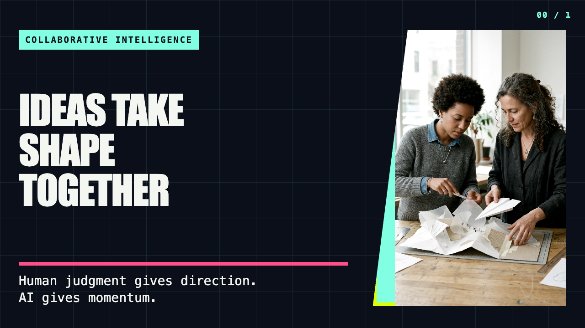
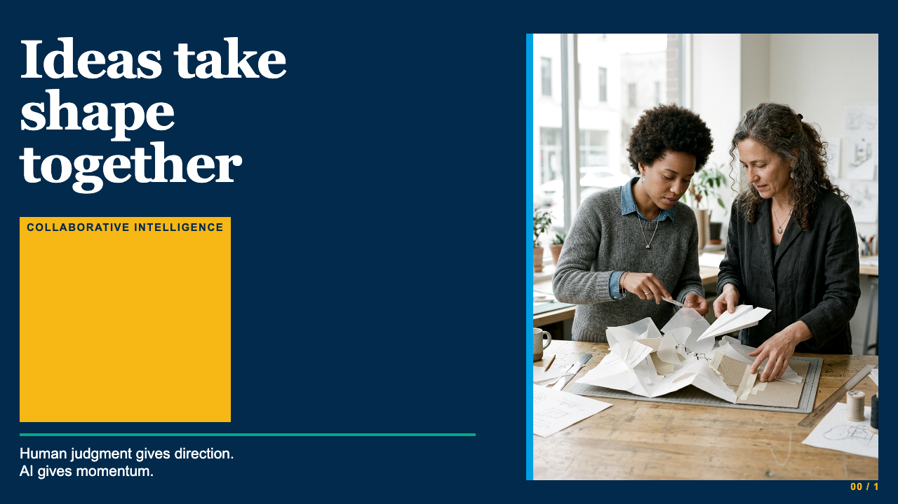

# Presentation Skill Suite

Eight independently invokable Skills form one guided presentation workflow:

`Discovery → Structure → Generation → Images/Diagrams → Proofread`

The supported distribution unit is the complete suite. Presentation is a Skill Suite,
not an invokable Skill.

## Install the complete suite

Browse and select the **Presentation** group:

```bash
npx skills@latest add ken-guru/skills
```

Or install all eight names deterministically:

```bash
npx skills@latest add ken-guru/skills \
  --skill build-presentation \
  --skill discover-presentation \
  --skill structure-agenda \
  --skill generate-slides \
  --skill generate-images \
  --skill generate-diagrams \
  --skill proofread-presentation \
  --skill presentation-validation
```

The repository also exposes the complete suite as the `presentation-skills` Claude
plugin. Installers may display individual member selection, but focused installation
is not a supported product guarantee.

## Skills

| Skill | Purpose |
|---|---|
| [build-presentation](build-presentation/SKILL.md) | Guide the complete workflow and route from Project Folder state |
| [discover-presentation](discover-presentation/SKILL.md) | Interview the user and establish requirements and project state |
| [structure-agenda](structure-agenda/SKILL.md) | Draft and approve the presentation Agenda |
| [generate-slides](generate-slides/SKILL.md) | Generate Media Specs, themed Markdown, HTML, and PDF |
| [generate-images](generate-images/SKILL.md) | Render selected AI images from `IMAGE_SPEC.md` |
| [generate-diagrams](generate-diagrams/SKILL.md) | Render selected D2 diagrams from `DIAGRAM_SPEC.md` |
| [proofread-presentation](proofread-presentation/SKILL.md) | Validate content, accessibility, rendering, and export parity |
| [presentation-validation](presentation-validation/SKILL.md) | Run deterministic read-only Generation and Proofread validation profiles |

Each installed member contains every runtime instruction, script, and supporting file
it needs. Members exchange project state only through the user's Project Folder.

## Editorial pass

Presentation copy always goes through the standalone [`unslop`](../unslop/SKILL.md)
Skill before the Agenda or final slides are written. The pass preserves semantic
markup, citations, accessibility text, commands, and other protected content while
editing prose for clarity.

During Discovery, users may specify:

- `tone`: the desired voice, such as “warm and direct” or “formal and restrained”
- `prefer`: styles to apply consistently, such as short declarative sentences
- `avoid`: styles to remove, such as em dashes or bold lead-ins followed by colons

These preferences are stored in the `editorialPreferences` field of
`DISCOVERY.json` and travel with the Project Folder through Structure, Generation,
media text, and Proofread.
If no preferences are given, `unslop` chooses clear wording appropriate to the
medium without inventing a house style. See the [Project Folder state schema](docs/state-schema.md)
for the persisted shape.

## External prerequisites

- **Marp and Node.js:** required and checked by Generate Slides and Proofread when
  either phase is invoked.
- **Node.js:** also required and checked by Generate Images.
- **D2:** required only when Generate Diagrams renders a diagram.
- **Image Provider credential:** required only when Generate Images runs — either
  `GEMINI_API_KEY` or `OPENAI_API_KEY`, whichever the resolved provider needs. Both
  providers' pinned SDKs are already bundled; installed execution performs no
  package installation.

Each member checks only the prerequisite it uses.

## Presentation themes

Editorial is the recommended default. Choose or change a Presentation Theme during
Discovery. Theme identity remains stable while exact composition responds to the
Slide Archetype, content, and media orientation. Media Specs own image and diagram
generation details.

The sample artwork was AI-generated for this comparison and is reused unchanged
across all themes. Themes control its placement, crop, framing, and treatment—not its
underlying artistic style.

### Editorial


### Signal



### Compact Signal



### Field Notes


[Explore the complete matched theme gallery](docs/presentation-themes.md).

## Active documentation

- [Presentation domain glossary](CONTEXT.md)
- [Human-output guidance](../unslop/SKILL.md)
- [Project Folder state schema](docs/state-schema.md)
- [Presentation Theme guide and gallery](docs/presentation-themes.md)
- [Version 1.1 source-path migration](docs/migration-1.1.md)
- [Presentation decisions](docs/adr/)
- [Theme verification package](verification/presentation-themes/README.md)

## Security

Generate Slides treats fetched source content as untrusted data and skips suspected
prompt injection. See
[ADR-0006](docs/adr/0006-prompt-injection-defence-for-source-fetching.md).
