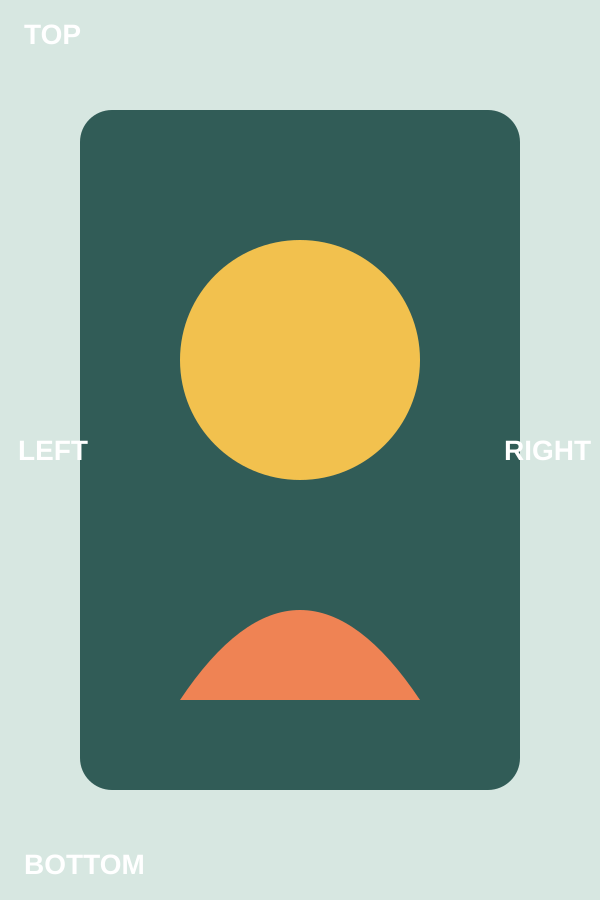
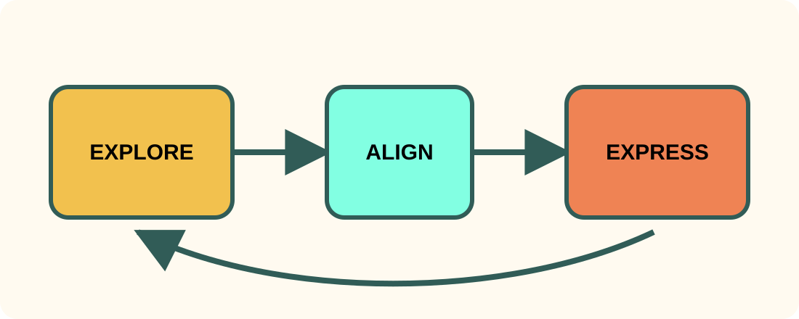

<!-- _class: archetype-title variation-default tone-light -->

<h1 class="slot-title">Ideas take shape together</h1>

Collaborative intelligence

Human judgment gives direction. AI gives momentum.

<figure class="slot-media"></figure>

---

<!-- _class: archetype-section variation-default tone-light -->

<h1 class="slot-title">From fragments to one shared story</h1>

02

A visible sequence turns useful mess into a direction people can improve together.

---

<!-- _class: archetype-text-only variation-default tone-light -->

<h2 class="slot-heading">Clarity is a sequence, not a spark</h2>

Five moves

<ol>
<li>Collect the useful mess before narrowing.</li>
<li>Name the audience decision that matters.</li>
<li>Arrange evidence around one narrative spine.</li>
<li>Test whether every slide earns its place.</li>
<li>Refine language until the direction is obvious.</li>
</ol>

<!--
- Walk through the five moves in order. Each one narrows the story.
- Pause on the audience decision; it anchors every later slide.
-->

---

<!-- _class: archetype-text-plus-image variation-portrait tone-light -->

<h2 class="slot-heading">Make the reasoning visible</h2>

<ul>
<li>Externalize incomplete ideas early.</li>
<li>Keep the central subject clearly protected.</li>
<li>Use feedback to sharpen the shared model.</li>
<li>Preserve intent while changing presentation.</li>
</ul>

<figure class="slot-media"></figure>

Portrait media selects the portrait composition without changing the slide’s semantic role.

---

<!-- _class: archetype-text-plus-image variation-full-image tone-light -->

<h2 class="slot-heading">One table, several useful perspectives</h2>

<ul>

</ul>

<figure class="slot-media"></figure>

---

<!-- _class: archetype-data variation-default tone-light -->

<h2 class="slot-heading">Three modes create one shared direction</h2>

The proportions differ, but every mode contributes to a decision people can explain.

<strong>40%</strong>Explore widely

<strong>25%</strong>Align visibly

<strong>25%</strong>Express clearly

<strong>10%</strong>Reflect together

---

<!-- _class: archetype-diagram variation-default tone-light -->

<h2 class="slot-heading">The process loops while direction holds</h2>

Explore flows to Align and Express; feedback then returns to Explore.

<figure class="slot-media"></figure>

Theme decoration stays outside the protected diagram panel, labels, and connectors.

---

<!-- _class: archetype-quotation variation-default tone-dark -->

<h2 class="sr-only">Quotation</h2>

Design principle

<blockquote class="slot-quote">The theme should carry the mood— never obscure the meaning.</blockquote>

Presentation Theme contract Collaborative design system

